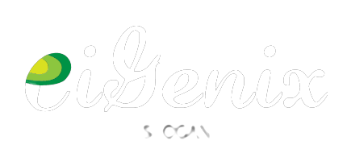

<h1 align="center">
  
</h1>

 UIgenix is curated list of awesome  &amp; cool  UI tenplates, designs, plugins, widgets and much more in one place. 
 
 

### Contents:
  - [Categories](#categories)
      - [personal Portfolio](#personal-portfolio)
      - [Portfolio](#portfolio)
      - [Blog Site](#blog-site)
      - [E-commerce](#ecommerce) 
      - [Clone Site](#clone-site)
      - [Cards](#cards)
      - [Dashboard](#dashboard)
      - [Fitness](#fitness)
      - [Food](#food)
      - [Landing Page](#landing-page)
      - [Movies](#movies)
      - [Music](#music)
      - [Pet](#pet)
      - [Social Apps](#social-apps)
      - [Travel](#travel)
      - [Guide](#guide)
  - [Plugin](#plugin)
  - [Tools](#tools)
  - [Conferences](#confrences)
  - [Contribute](#contribute)
  - [License](#license)

## Categories

#### Personal Portfolio
- [Single page Portfolio](https://www.figma.com/file/IgQDuQqXUUpx0rBxi0y9ZJ/Single-Page-Portfolio?node-id=0%3A1&t=sXoHWXwCfygWrDrB-1)

#### Portfolio

#### Blog Site

#### E-commerce

#### Clone Site

#### Cards

#### Dashboard

#### Fitness

#### Food

#### Landing Page

#### Movies

#### Pet

#### Social Apps

#### Travel

#### Guide

## Plugin

## Plugin

## Conferences

## Contribute

## License

> **Twitter** <a href="https://www.twitter.com/imaaquibali" target="_blank" rel="noopener">@imaaquibali</a> &nbsp;&middot;&nbsp; **Github** <a href="https://github.com/imaaquibali" target="_blank" rel="noopener">@imaaquibali'</a> &nbsp;&middot;&nbsp; **Linkedin** <a href="https://linkedin.com/in/imaaquibali" target="_blank" rel="noopener">@imaaquibali</a> **Medium** <a href="https://medium.com/@imaaquibali" target="_blank" rel="noopener">@imaaquibali</a>  **Instagram** <a href="https://instagram.com/imaaquibali/" target="_blank" rel="noopener">@imaaquibali</a> 
**Discord** <a href="https://dsc.gg/theversiton" target="_blank" rel="noopener">The VerSiton'</a> &nbsp;&middot;&nbsp; 
